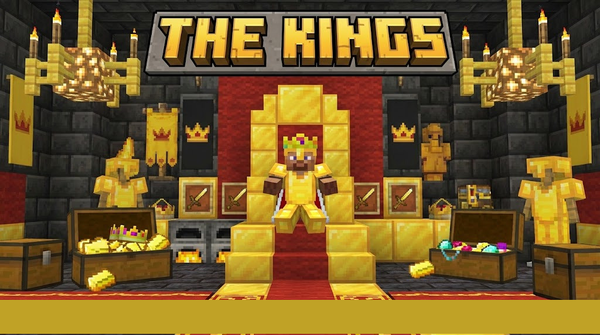

  

#  Mod Simples de Desenvolvimento

> Um projeto pessoal para o Minecraft Fabric 1.21.1 que adiciona alguns itens e blocos customizados.

##  Status

Este mod está em **desenvolvimento ativo**.

* **Minecraft:** 1.21.1
* **API:** Fabric
* **Licença:** MIT

---

##  O que Este Mod Faz

Este mod é um *sandbox* para testes e aprendizado. Atualmente, ele adiciona:

* **Novos Itens:** [Carvão soberano, Picareta Do Rei, Espada Do Rei, Comida Do Rei, E futuramente novas entidades podendo fazer trocas].
* **Novos Blocos:** [Bloco Do Rei].

---

##  Como Usar (Testes)

Para testar ou debugar:

1.  Baixe o arquivo `.jar` mais recente na aba **Releases** do repositório.
2.  Instale o **Fabric Loader** para a versão 1.21.1.
3.  Coloque o arquivo `.jar` do mod na sua pasta `mods/` e inicie o jogo.
